# 몰래항 (가칭)

> 지루한 시간(수업·회의) 동안 알아서 쌓이는 자원을 틈틈이 수거해 배를 키우는 유휴(idle) 게임.

무한의 바다 위에 배 한 척. 시간이 지나면 자원이 알아서 쌓이고, 수거할 때마다
**무작위 부품이 나와서 전부 그대로 배에 붙는다.** 고를 수 없다.
그래서 엔진만 열두 개 달린 배가 되기도 하고, 이끼만 잔뜩 껴서 유령선이 되기도 한다.

<p align="center">
  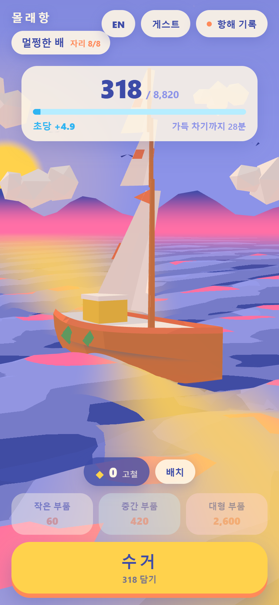
  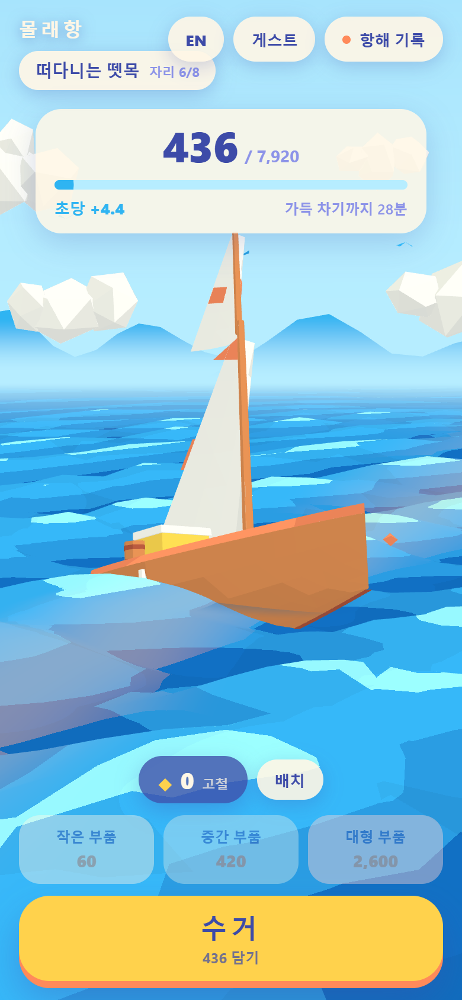
  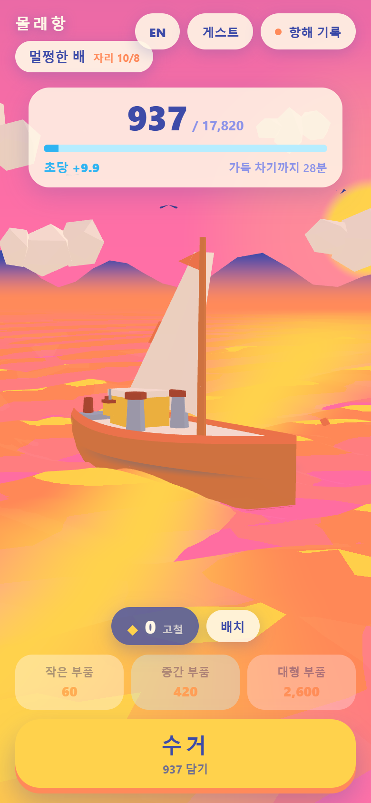
  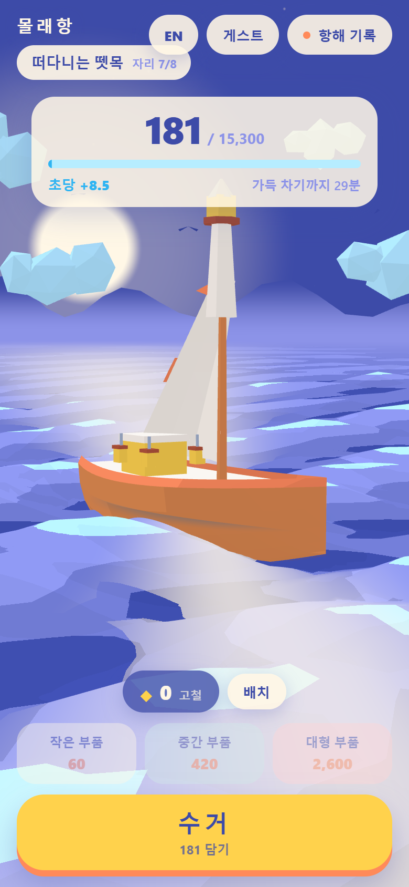
  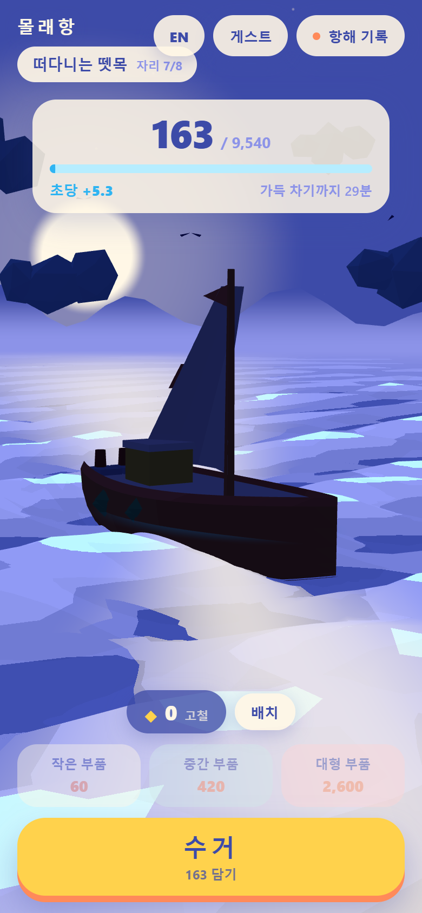
</p>

<p align="center">
  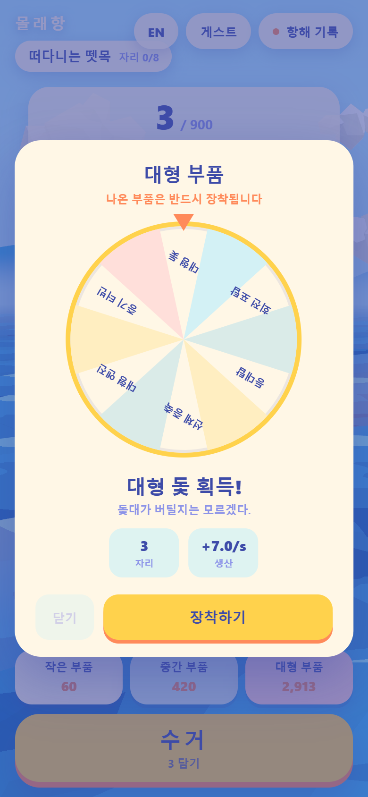
  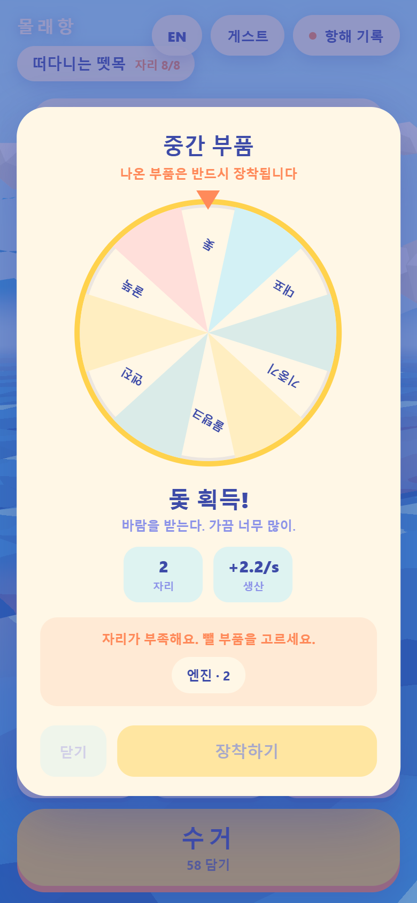
  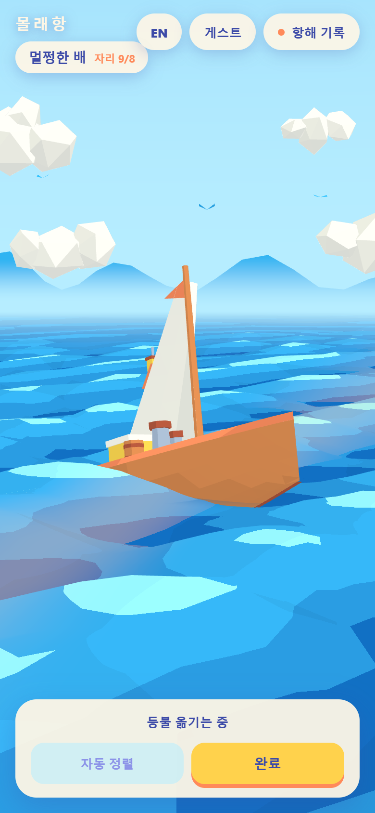
  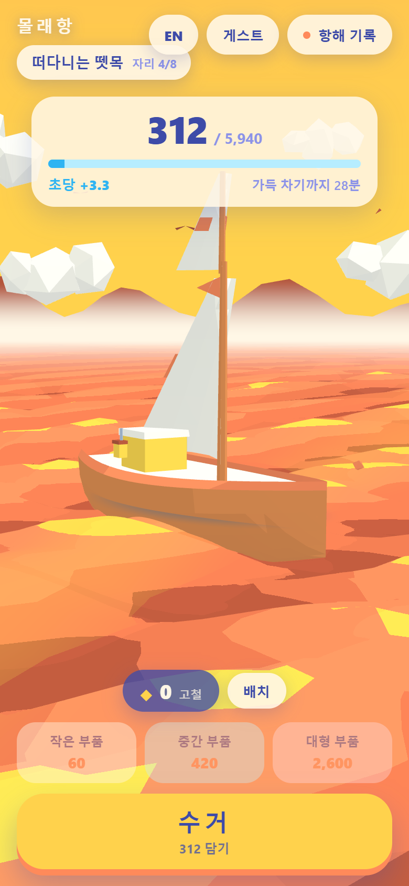
  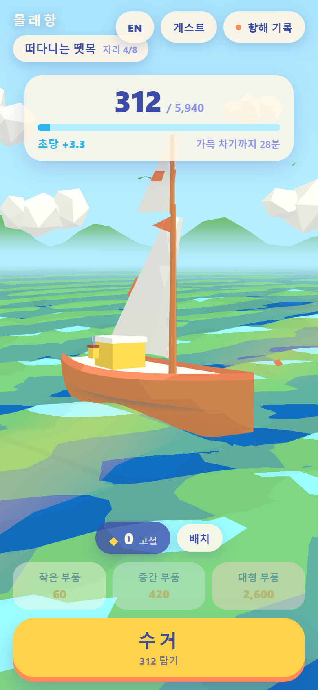
</p>

<p align="center">
  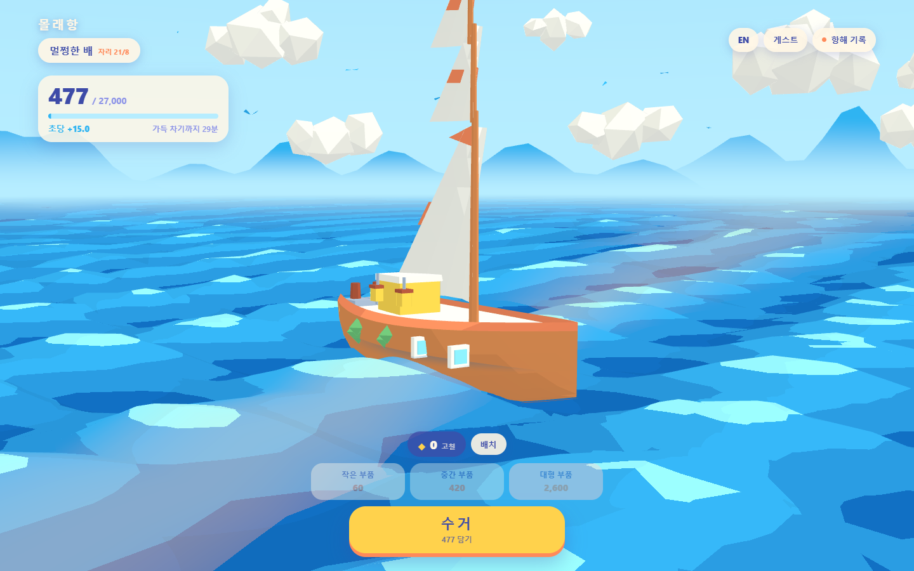
</p>

## 실행

```bash
npm install
npm run dev
```

| 스크립트 | 하는 일 |
| --- | --- |
| `npm run dev` | 개발 서버 (http://localhost:5173) |
| `npm run build` | 타입 검사 + 프로덕션 빌드 |
| `npm run shots` | Playwright 로 모바일·PC 스크린샷 + 밝기 자동 검증 |

`npm run shots` 는 처음 한 번 브라우저 설치가 필요하다: `npx playwright install chromium`

## 들어 있는 것

**씬**
- 무한의 바다 — 수평선까지 이어지고 먼 거리는 하늘 색으로 흐려진다
- 해/달이 수평선에 낮게 걸리고, 물 위로 **반사 길**이 길게 떨어진다
- 접속한 **기기의 로컬 시각**에 따라 새벽 / 낮 / 노을 / 밤이 자동으로 바뀐다 (부드럽게 보간)
- 수평선의 섬 실루엣, 두 층으로 흐르는 로우폴리 구름, 하늘을 도는 새
- 코드로 생성한 파라메트릭 선체 + 물에 잠긴 자리의 포말 링

**코어 루프**
- 분당 30 자동 축적, 상한 600, 창을 닫아도 흐르는 오프라인 축적
- 수거 → 자원 결정이 갑판 상자로 빨려 들어가는 파티클 + 배 바운스
- 타임스탬프 로그와 기록 시트

**파츠 & 시크릿 전직**
- 8종(엔진·창문·대포·굴뚝·돛·이끼·등불·통)이 가중치 확률로 나온다
- **나온 건 전부 장착된다.** 소켓이 차면 위로 쌓인다 — 엔진 12개면 4층 엔진탑
- 구성에 따라 숨은 칭호 11종 (이끼 유령선, 폭주 기관선, 돛의 탑, 고철 요새 …)

**선단 — 혼자도 되지만 같이 하면 빨라진다**
- 초대 코드(6자리)로 최대 4명까지 묶인다. 링크 하나로 초대
- **같이 접속해 있는 동안** 축적 속도 1인당 +15% (최대 +45%)
- 친구가 수거하면 그 양의 12%가 나에게 떨어지고, **부품 하나가 내 배에도 붙는다**
- 혼자일 때는 선단 UI가 아예 숨는다 — 혼자 하는 사람에게 결핍을 만들지 않는다

> 지금 통신은 `BroadcastChannel` 이라 **같은 브라우저의 다른 탭·창**끼리만 이어집니다.
> 다른 기기의 친구와 연결하려면 서버(Supabase Realtime) 연결이 필요하고,
> 인터페이스(`CrewChannel`)는 그대로 갈아끼울 수 있게 분리해 두었습니다.
> 지금 해 보려면: 초대 링크를 복사해 새 탭에 `&seat=b` 를 붙여 열면 두 번째 선원이 됩니다.

**바다 테마 6종**
- 테마 뽑기로 해금. 같은 15색을 다르게 조합해서, 어떤 테마를 뽑아도 한 팔레트 안에 머문다
- 푸른 바다 · 에메랄드 만 · 장밋빛 해협 · 잿불 해역 · 강철 해협 · 심해 항로

**계정**
- 게스트로 전부 즐길 수 있고, 로그인은 선택
- 이메일 6자리 코드 인증 (매직 링크 아님)
- 계정당 배 여러 척. 처음 로그인할 때 게스트로 키우던 배를 가져갈지 물어본다
- 로그인 시 축적 정산은 서버(`sync_ship` RPC)가 `now()` 로 한다 — 기기 시계 조작 무효

**그 외**
- 첫 방문 튜토리얼 6스텝 (시트에서 다시 보기 가능)
- 한국어 / English 전환 (기본 한국어)
- 모바일 세로 / PC 가로 두 벌의 레이아웃 (PC에서는 기록이 오른쪽 사이드 패널)

들어 있지 **않은** 것: 수익화, 파츠 판매/강화 UI, 랭킹.

## 배포

`main` 에 푸시하면 GitHub Actions 가 빌드해서 GitHub Pages 로 올린다 (`.github/workflows/deploy.yml`).
저장소에서 **Settings → Pages → Source 를 "GitHub Actions"** 로 한 번만 바꿔 주면 그다음부터 자동이다.

파일 하나로 만들어 그냥 열거나 아무 데나 올리고 싶다면:

```bash
npm run build && npm run build:standalone   # dist/molehang-standalone.html
```

## 구조

```
src/
  style/palette.ts     15색 고정 팔레트 — 프로젝트 모든 색의 유일한 출처
  style/style.css      UI 스타일 (팔레트가 주입한 --mh-* 변수만 사용)
  core/clock.ts        Clock 인터페이스        ← 나중에 서버 시각으로 교체
  core/time-of-day.ts  시각 → 씬 색/조명 보간
  game/accrual.ts      축적 계산 (순수 함수)   ← 나중에 서버에서 재사용
  game/parts.ts        파츠 확률 · 인벤토리 · 칭호 판정
  game/crew.ts         선단 보너스 · 선물 · 초대 코드 (순수 계산)
  game/crew-session.ts 내 코드/이름 보관 + 채널 접속
  net/crew-channel.ts  CrewChannel 인터페이스 ← 나중에 Supabase Realtime 으로 교체
  game/gateway.ts      MolehangGateway 인터페이스 ← 나중에 Supabase 구현체로 교체
  game/local-gateway.ts  localStorage 구현
  game/game.ts         게이트웨이 ↔ 화면 사이 얇은 층
  scene/
    world.ts           씬 조립 + 렌더 루프
    framing.ts         카메라 — 하늘 요소 배치의 기준
    ocean.ts           무한 바다 (파도 · 톤 스텝 · 반사 길 · 헤이즈)
    sky.ts             그라데이션 스카이돔 (해/달 · 별)
    islands.ts  clouds.ts  birds.ts  foam.ts  shadow-blob.ts
    hull.ts            선체 지오메트리 생성기
    boat.ts            선체 + 인벤토리 기반 파츠 장착
    part-sockets.ts    파츠 지오메트리와 소켓 배치 규칙
    flat-material.ts   플랫 셰이딩 전용 머티리얼
  fx/motes.ts          자원 결정 / 수거 파티클
  ui/                  hud · sheet · tutorial · toast · format
tools/shots.mjs        스크린샷 + 밝기 검증
```

## 나중에 Supabase 로 옮길 때

교체 지점은 세 군데뿐이고, 전부 인터페이스 뒤에 있다.

1. `Clock` → 서버 시각 오프셋 클럭 (`OffsetClock` 이 자리표시자)
2. `MolehangGateway` → `SupabaseGateway`. 게이트웨이 메서드는 지금도 전부 `Promise` 를 반환한다
3. `accrual.ts` 의 순수 함수와 `parts.ts` 의 확률·칭호 판정을 Edge Function 에 그대로 복사

UI·씬 코드는 `localStorage` 를 직접 만지지 않으므로 호출부는 바뀌지 않는다.

## 디버그 쿼리 파라미터

| 파라미터 | 예 | 효과 |
| --- | --- | --- |
| `hour` | `?hour=18.5` | 연출 시각 강제 (자원 축적에는 영향 없음) |
| `phase` | `?phase=dusk` | `dawn` / `day` / `dusk` / `night` |
| `res` | `?res=full` | 보유 자원 강제 |
| `parts` | `?parts=engine*12,moss*8` | 파츠 강제 장착 |
| `scrap` | `?scrap=9000` | 고철 잔고 강제 |
| `theme` | `?theme=ember` | 테마 강제 해금·적용 |
| `crew` | `?crew=ABCDEF` | 초대 코드로 선단 합류 |
| `guest` | `?guest=1` | 로그인 무시하고 게스트로 시작 |
| `seat` | `?seat=b` | 세이브 분리 — 같은 기기에서 친구 역할 하나 더 띄우기 |
| `notutorial` | `?notutorial=1` | 튜토리얼 건너뛰기 |
| `probe` | `?probe=1` | `window.molehang.sampleLuminance()` 활성화 |

## 기여 규칙

아트 디렉션과 코드 규칙은 [CLAUDE.md](CLAUDE.md) 에 있다. **먼저 읽을 것.**
특히 색은 `src/style/palette.ts` 밖에서 절대 만들지 않는다.
