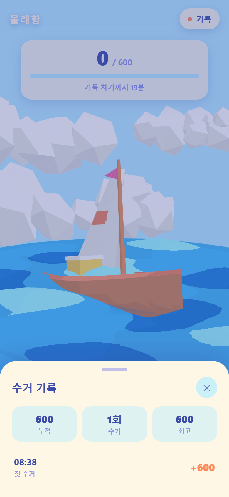

# 몰래항 (가칭)

> 지루한 시간(수업·회의) 동안 알아서 쌓이는 자원을 틈틈이 수거해 배를 조립하는 유휴(idle) 게임.
> **이 저장소는 조립 전 단계까지의 데모다.**

하늘에 떠 있는 원형 바다 위에 배 한 척. 시간이 지나면 자원이 알아서 쌓이고,
하단의 큰 버튼으로 수거하면 결정들이 갑판 상자로 빨려 들어간다.

<p align="center">
  
  
  
  
  
</p>

## 실행

```bash
npm install
npm run dev
```

| 스크립트 | 하는 일 |
| --- | --- |
| `npm run dev` | 개발 서버 (http://localhost:5173) |
| `npm run build` | 타입 검사 + 프로덕션 빌드 |
| `npm run shots` | Playwright 로 4개 시간대 스크린샷 + 밝기 자동 검증 |

`npm run shots` 는 처음 한 번 브라우저 설치가 필요하다: `npx playwright install chromium`

## 데모에 들어 있는 것

- **씬** — 그라데이션 스카이돔(낮/노을/밤/새벽 4단계 보간), 사인파 버텍스 셰이더 + 3단 톤 스텝 바다,
  로우폴리 구름 2개 층, 코드로 생성한 파라메트릭 선체
- **코어 루프** — 시간 경과에 따른 자동 축적(분당 30, 상한 600), 오프라인 축적, 수거, 타임스탬프 로그, 기록 시트
- **수거 피드백** — 자원 결정이 갑판 상자로 빨려 들어가는 파티클 + 배 스케일 바운스

들어 있지 **않은** 것: 부품 조립, 소켓, 배 전직, 서버, 로그인, 소셜, 수익화. 전부 범위 밖이다.

## 구조

```
src/
  style/palette.ts     12색 고정 팔레트 — 프로젝트 모든 색의 유일한 출처
  style/style.css      UI 스타일 (팔레트가 주입한 --mh-* 변수만 사용)
  core/clock.ts        Clock 인터페이스        ← 나중에 서버 시각으로 교체
  core/time-of-day.ts  시각 → 씬 색/조명 보간
  game/accrual.ts      축적 계산 (순수 함수)   ← 나중에 서버에서 재사용
  game/gateway.ts      MolehangGateway 인터페이스 ← 나중에 Supabase 구현체로 교체
  game/local-gateway.ts  localStorage 구현
  game/game.ts         게이트웨이 ↔ 화면 사이 얇은 층
  scene/               world · sky · ocean · clouds · boat · lights · framing · flat-material
  fx/motes.ts          자원 결정 / 수거 파티클
  ui/                  hud · sheet · format
tools/shots.mjs        스크린샷 + 밝기 검증
```

## 나중에 Supabase 로 옮길 때

교체 지점은 세 군데뿐이고, 전부 인터페이스 뒤에 있다.

1. `Clock` → 서버 시각 오프셋 클럭 (`OffsetClock` 이 자리표시자)
2. `MolehangGateway` → `SupabaseGateway`. 게이트웨이 메서드는 지금도 전부 `Promise` 를 반환한다
3. `accrual.ts` 의 순수 함수를 Edge Function 에 그대로 복사해 서버 권위 계산으로 사용

UI·씬 코드는 `localStorage` 를 직접 만지지 않으므로 호출부는 바뀌지 않는다.

## 디버그 쿼리 파라미터

| 파라미터 | 예 | 효과 |
| --- | --- | --- |
| `hour` | `?hour=18.5` | 연출 시각 강제 (자원 축적에는 영향 없음) |
| `phase` | `?phase=dusk` | `dawn` / `day` / `dusk` / `night` |
| `res` | `?res=full` | 보유 자원 강제 |
| `probe` | `?probe=1` | `window.molehang.sampleLuminance()` 활성화 |

## 기여 규칙

아트 디렉션과 코드 규칙은 [CLAUDE.md](CLAUDE.md) 에 있다. **먼저 읽을 것.**
특히 색은 `src/style/palette.ts` 밖에서 절대 만들지 않는다.
